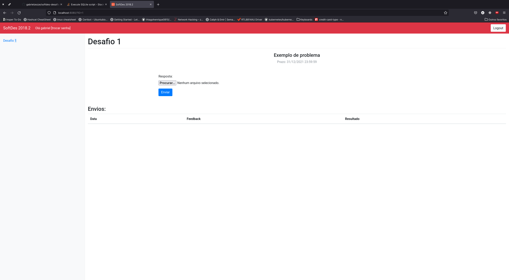

# Descrição

Este prjeto é o servidor de desafios usado na disciplina Design de Software do primeiro semestre de engenharia do Insper.
O servidor tinha a funcao de disponibilizar desafios para os alunos fazerem enviarem os arquivos com as respostas. Essas respostas serão testadas na hora, retornado o resultado do desafio. Será retornado um OK caso o desafio satisfaça o proposito e um erro caso não.

## How to run

1. Primeiro é necessario instalar as dependências, isto pode ser feito usando o Pipenv

```bash
> pipenv install
```

2. Segundo basta executar o servidor usando o pipenv, lembrando que como estamos rodando o servidor na porta 80 (porta reservada) e' necessario rodar com root.

```bash
> sudo pipenv run python softdes.py
```

A partir de agora voce possui o servidor de desafios rodando em http://localhost:80/


